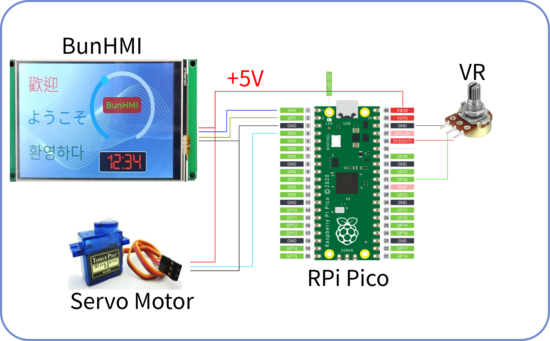

# BunHMI arduino demo
This project demo how to use arduino to interact with BunHMI.

# BunHMI
For detail of BunHMI Display, please check https://shop.mcuidea.com/

The directory [BunHMI] contain the project of [BunMaker](https://shop.mcuidea.com/bunmaker). BunMaker is a GUI editor which is free to download

# Arduino
## RPi pico
This demo is using RPI pico. For using RPI pico in arduino, please check https://github.com/earlephilhower/arduino-pico

## Other Arduino board
You can use other Arduino board which should work in similar way. Just check the pin assignment of PIO, AIN and UART port should match with the code assignment.

## arduino-timer
The arduino-timer library can be found in https://www.arduino.cc/reference/en/libraries/arduino-timer/, download the ZIP library.

To install library: arduino-IDE->Sketch->Include Library->Add ZIP library.

## Demo code
The directory [arduino_pico] contain the demo code of RPI pico.

# Hardware
This schmatic diagram of this demo is showing as following. The pico linked with BunHMI by UART interface.

Server motor is controlled by PWM and VR is the simulation of Analog input.

